# Módulo API HTTP

## Scope

El módulo API HTTP es la frontera del sistema con el mundo. Levanta el servidor Express,
publica la especificación OpenAPI, monta las once rutas de la API y, para cada una,
traduce en las dos direcciones: de la request HTTP a los argumentos que espera una
operación de negocio, y del objeto de dominio que vuelve — o de la excepción que se lanzó
— al JSON y al código de estado de la respuesta.

Es el único módulo que conoce `req`, `res`, códigos de estado y la forma JSON de la API.
No decide nada de negocio: qué es un plato válido, cómo se calcula el estado de una
comanda o cómo se guarda algo son responsabilidades de otros módulos.

## Component diagram

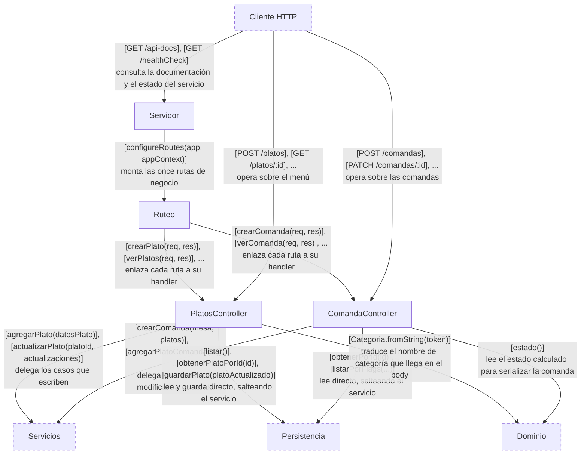

## Servidor

**Responsabilidad.** Configurar la aplicación Express y ponerla a escuchar: el parseo de
JSON, la interfaz de Swagger sobre `docs.yaml`, el endpoint de salud, y el montaje de las
rutas de negocio.

**Estado.** La aplicación Express, el puerto y la especificación OpenAPI leída de disco.

**Interfacing points.** `startServer(app, port, appContext)`.

### `startServer(app, port, appContext)`

Instala `body-parser` en modo JSON, publica Swagger UI en `/api-docs` con la
especificación parseada de `docs.yaml`, define `GET /healthCheck` en línea, delega el
montaje de las rutas de negocio al Ruteo y llama a `listen`.

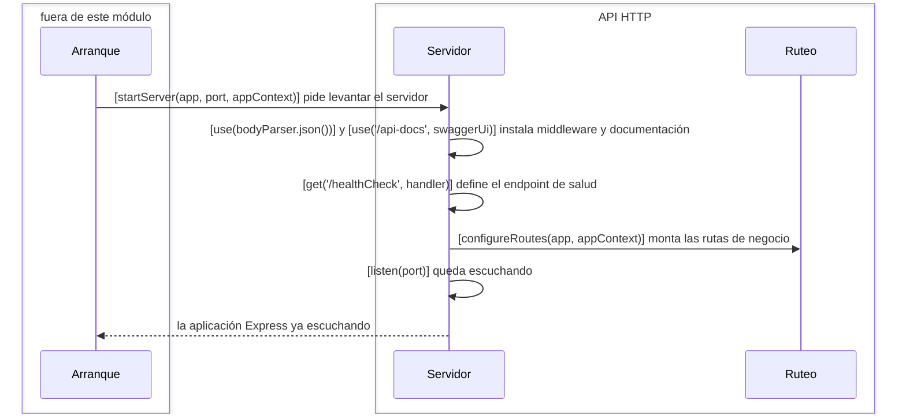

#### Edge cases

`docs.yaml` se lee de forma síncrona al importar el módulo, con una ruta relativa al
directorio de trabajo. Arrancar el proceso desde otro directorio rompe el import antes de
que `startServer` llegue a ejecutarse.

## Ruteo

**Responsabilidad.** Ser la tabla que mapea método y path a la operación de controlador
que responde. Es el único lugar donde se ve la superficie completa de la API de un
vistazo.

**Estado.** Ninguno propio — escribe sobre la aplicación Express que recibe.

**Interfacing points.** `configureRoutes(app, appContext)`.

### `configureRoutes(app, appContext)`

Toma del contexto los dos controladores y registra las once rutas. Cada handler se
registra con `bind` al controlador, porque Express lo invoca desacoplado de su objeto y
sin eso `this` llegaría indefinido dentro del método.

| Método | Path | Operación |
|---|---|---|
| POST | `/platos` | `PlatosController.crearPlato` |
| GET | `/platos` | `PlatosController.verPlatos` |
| GET | `/platos/:id` | `PlatosController.verPlato` |
| PUT | `/platos/:id` | `PlatosController.actualizarPlato` |
| PATCH | `/platos/:id` | `PlatosController.marcarPlatoDisponible` |
| POST | `/comandas` | `ComandaController.crearComanda` |
| GET | `/comandas` | `ComandaController.buscarComanda` |
| GET | `/comandas/:id` | `ComandaController.verComanda` |
| PATCH | `/comandas/:id` | `ComandaController.actualizarBebidasComanda` |
| POST | `/comandas/:id/platos` | `ComandaController.agregarPlatosComanda` |
| PATCH | `/comandas/:id/platos/:ordenPlato` | `ComandaController.actualizarPlatoComanda` |

## PlatosController

**Responsabilidad.** Responder los cinco endpoints del menú: leer de la request lo que
cada operación necesita, invocarla, y devolver el plato serializado o el error traducido
a un código de estado.

**Estado.** Las referencias al `PlatosService` y al `Menu`.

**Interfacing points.** `new PlatosController(platosService, menu)`, `crearPlato(req, res)`,
`verPlatos(req, res)`, `verPlato(req, res)`, `actualizarPlato(req, res)`,
`marcarPlatoDisponible(req, res)`.

### `new PlatosController(platosService, menu)`

Guarda las dos referencias que sus handlers usan. El segundo parámetro es la huella, en
el cableado, de que tres de los cinco endpoints leen del `Menu` sin pasar por el
servicio.

### `crearPlato(req, res)`

Convierte el body al vocabulario del dominio, le pide al servicio que dé de alta el
plato, y responde 201 con el plato ya con id. Si el plato no valida, responde 400 con el
mensaje de la excepción.

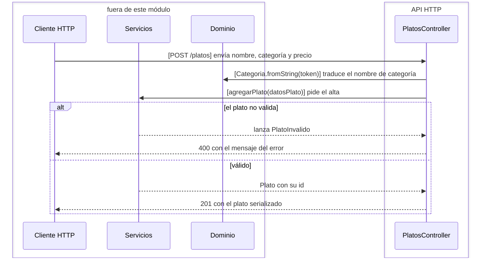

#### Edge cases

Una categoría desconocida hace que `Categoria.fromString` devuelva `undefined`, y el
constructor del `Plato` la rechaza como campo faltante: la respuesta es 400 con un
mensaje que dice que faltó la categoría, no que era inválida.

Cualquier excepción que no sea `PlatoInvalido` se loguea y no produce respuesta: la
request queda sin contestar hasta que el cliente corta.

### `verPlatos(req, res)`

Pide al `Menu` la lista completa y responde 200 con todos los platos serializados. No
pasa por el servicio y no maneja errores.

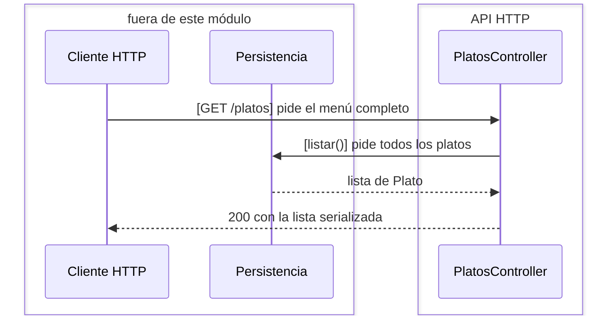

### `verPlato(req, res)`

Pide al `Menu` el plato del path. Responde 200 con el plato serializado, o 404 si el
`Menu` lanza `PlatoInexistente`. No pasa por el servicio.

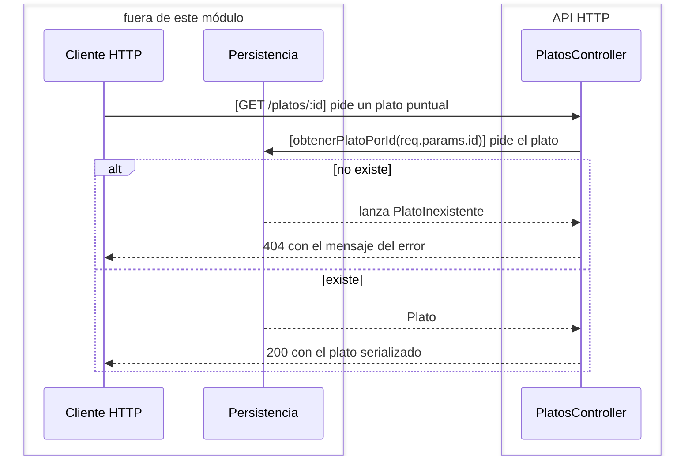

### `actualizarPlato(req, res)`

Convierte el body al vocabulario del dominio y le pide al servicio que aplique los
cambios. Responde 200 con el plato actualizado, 404 si el plato no existe, 400 si la
actualización lo deja inválido.

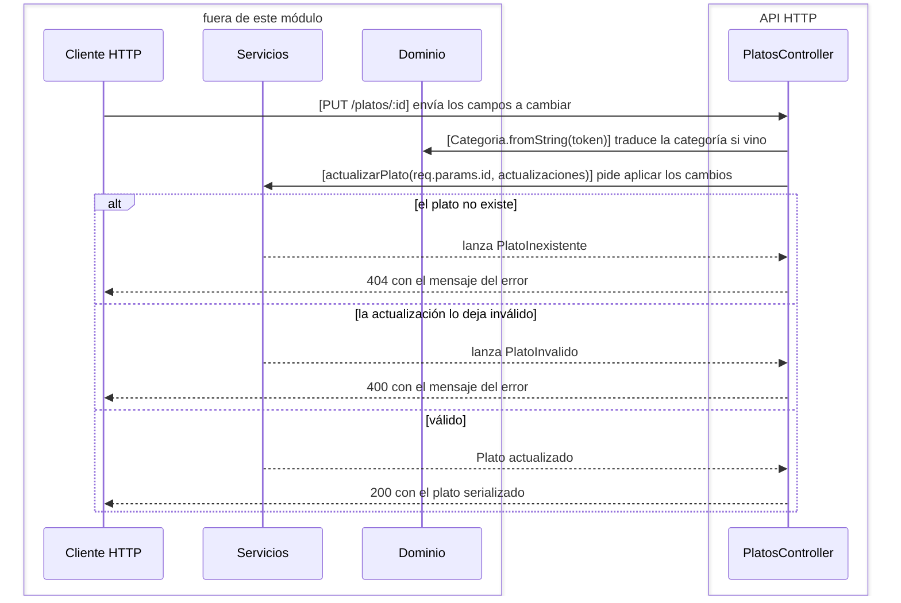

### `marcarPlatoDisponible(req, res)`

Trae el plato del `Menu`, le fija `estaDisponible` al valor del body o lo invierte si el
body no lo trae, y lo manda a guardar. Responde 200 con el plato actualizado, o 404 si no
existe.

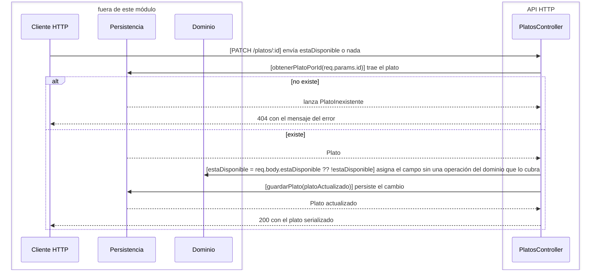

#### Edge cases

La regla "si no viene el valor, invertir" es la única regla de negocio que vive en este
módulo. `Plato` no expone una operación para cambiar la disponibilidad, así que el
controlador escribe el campo directamente.

### Specifics

La traducción entre el JSON de la API y el dominio la hacen dos funciones privadas del
archivo: `dePlatoRest` — que convierte el nombre de categoría del body en la `Categoria`
del dominio — y `aPlatoRest`, que hace el camino inverso al serializar. No son
componentes: son el detalle interno de cómo este controlador cumple su responsabilidad de
traducir.

## ComandaController

**Responsabilidad.** Responder los seis endpoints de comandas: leer de la request lo que
cada operación necesita, invocarla, y devolver la comanda serializada — con su estado ya
calculado — o el error traducido a un código de estado.

**Estado.** Las referencias al `ComandaService` y al `ComandaRepository`.

**Interfacing points.** `new ComandaController(comandaService, comandaRepository)`,
`crearComanda(req, res)`, `verComanda(req, res)`, `agregarPlatosComanda(req, res)`,
`actualizarBebidasComanda(req, res)`, `actualizarPlatoComanda(req, res)`,
`buscarComanda(req, res)`.

### `new ComandaController(comandaService, comandaRepository)`

Guarda las dos referencias que sus handlers usan. El segundo parámetro es la huella del
par de endpoints que leen del repositorio sin pasar por el servicio.

### `crearComanda(req, res)`

Le pasa al servicio la mesa y la lista de platos del body. Responde 201 con la comanda
serializada, o 400 si la comanda es inválida o alguno de los platos no existe en el menú.

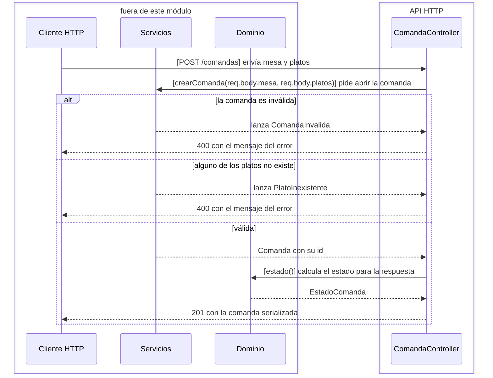

### `verComanda(req, res)`

Pide la comanda al `ComandaRepository`. Responde 200 con la comanda serializada, o 404 si
lanza `ComandaInexistente`. No pasa por el servicio.

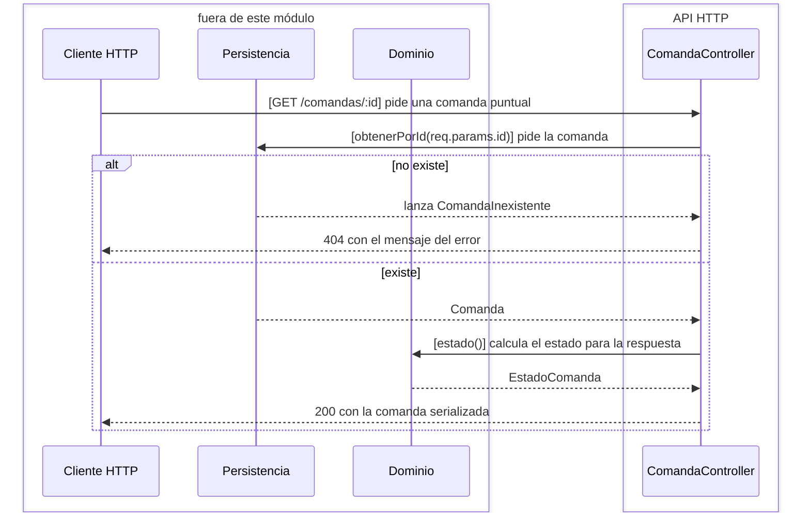

### `agregarPlatosComanda(req, res)`

Le pasa al servicio el id de la comanda y el body con el plato a sumar. Responde 200 con
la comanda serializada, o 400 si la comanda o el plato no existen.

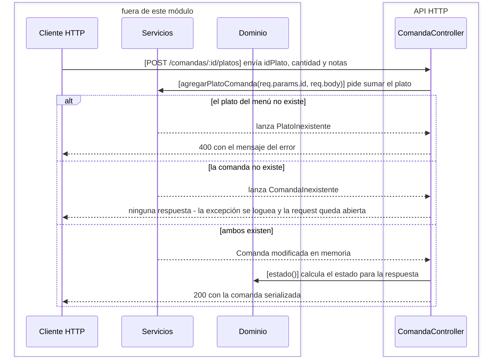

#### Edge cases

`ComandaInexistente` no está entre las excepciones que este handler traduce: si la
comanda no existe, se loguea y la request queda sin respuesta.

### `actualizarBebidasComanda(req, res)`

Le pasa al servicio el id y el flag `bebidasListas` del body. Responde 200 con la comanda
serializada.

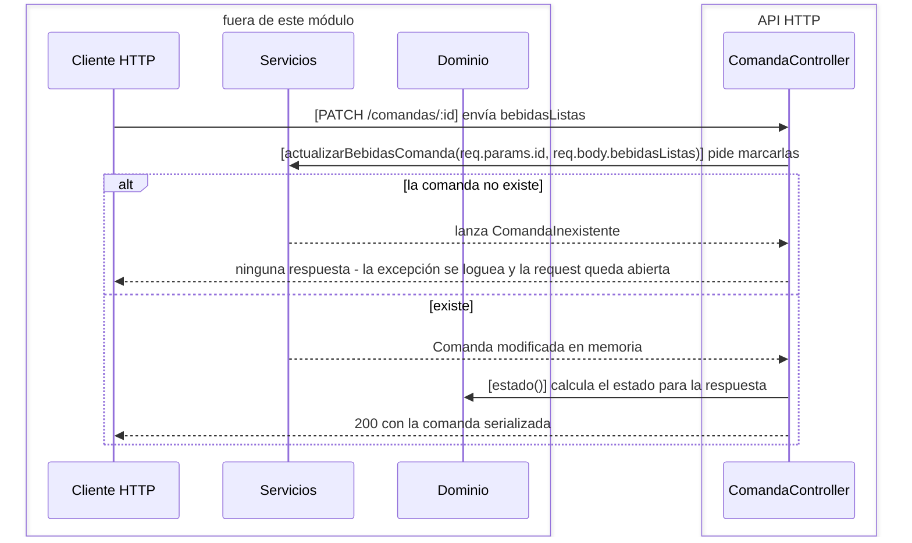

### `actualizarPlatoComanda(req, res)`

Le pasa al servicio el id de la comanda, el body con notas, cantidad o `estaListo`, y el
índice del plato dentro de la comanda. Responde 200 con la comanda serializada, 404 si la
comanda no existe, 400 si es inválida o el plato no existe.

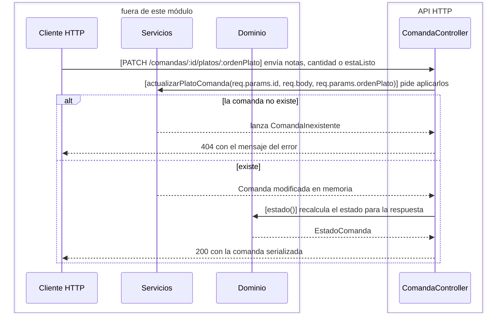

#### Edge cases

`ordenPlato` llega como string desde el path y se usa tal cual como índice del arreglo de
platos. Funciona porque el acceso por índice de JavaScript convierte la clave, pero un
índice fuera de rango no da 404 — da un `TypeError` que ningún `catch` traduce.

### `buscarComanda(req, res)`

Parsea los dos flags de query con `JSON.parse` para convertir `"true"` y `"false"` en
booleanos, y se los pasa al repositorio. Responde 200 con la lista serializada. No pasa
por el servicio y no maneja errores.

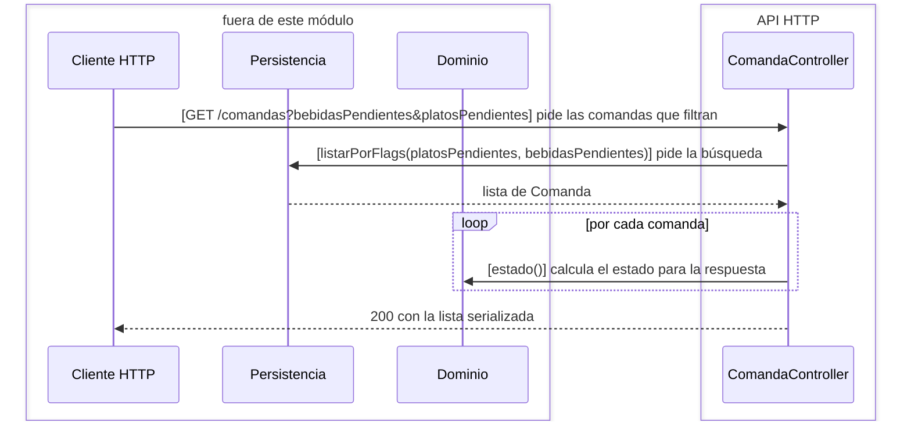

#### Edge cases

Un valor de query que no sea JSON válido — `?bebidasPendientes=si` — hace que
`JSON.parse` lance, y no hay `try` alrededor: la request muere con el error por defecto
de Express.

### Specifics

La serialización la hace `aComandaRest`, una función privada del archivo: aplana cada
`PlatoPedido` a nombre, cantidad, precio, notas y estado, y pide a la comanda su
`estado()` para exponerlo como un string. Es el único lugar donde el estado calculado de
una comanda se convierte en texto.

## Rejected alternatives

**Un controlador por endpoint.** Agruparlos por recurso mantiene junta la traducción
JSON del recurso — `aPlatoRest` y `dePlatoRest` tienen un solo dueño — y deja el archivo
de rutas legible como la tabla de la API.

**Middleware de errores centralizado.** Cada handler traduce sus propias excepciones a
códigos de estado. Es más repetitivo, pero deja visible en cada operación qué puede
fallar y con qué código se responde, que es exactamente lo que el ejercicio quiere que se
vea.
