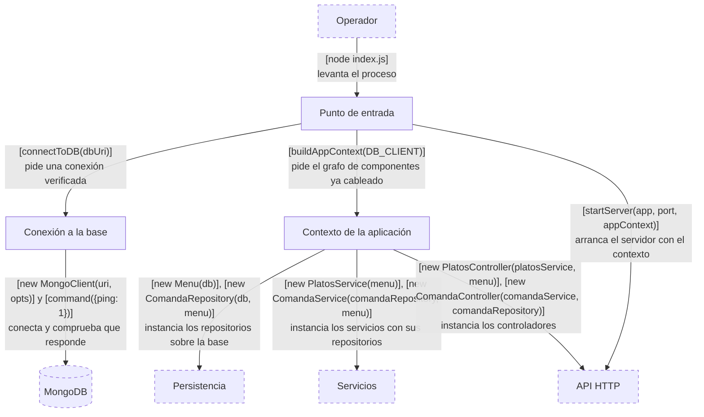
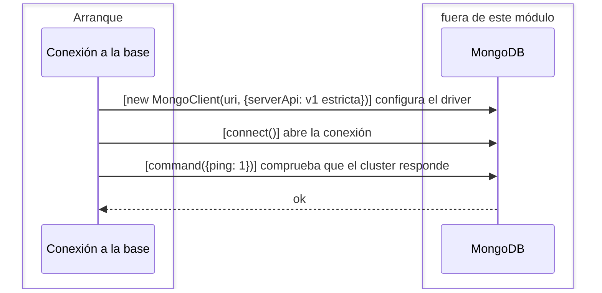
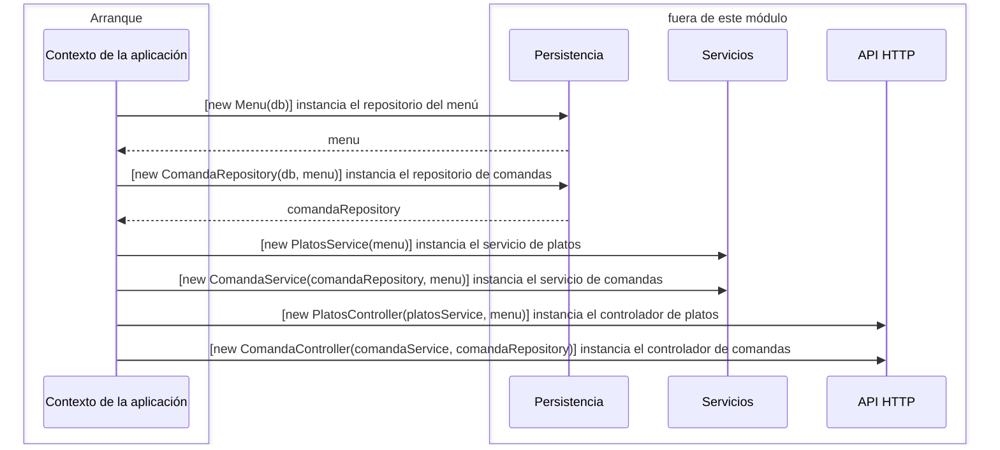

# Módulo Arranque

## Scope

El módulo Arranque pone el sistema en pie. Abre y verifica la conexión a MongoDB,
instancia una sola vez cada repositorio, servicio y controlador con sus dependencias ya
resueltas, y le entrega ese grafo al servidor.

Es el único módulo que conoce configuración concreta: la URI de la base, el nombre de la
base y el puerto. Y es el único lugar donde se decide qué implementación recibe cada
componente — ningún otro módulo instancia sus propias dependencias. No sabe nada de HTTP
más allá de arrancar el servidor, ni de platos, ni de comandas.

## Component diagram

## Punto de entrada

**Responsabilidad.** Ser el guion del arranque: fijar la configuración concreta —
`PORT`, `DB_URI` — y encadenar los tres pasos en orden, porque cada uno depende del
anterior.

**Estado.** El puerto, la URI de la base y la aplicación Express recién creada.

**Interfacing points.** Ninguno. Es un script que se ejecuta, no un componente al que se
le pide algo: su interfaz es `node index.js`. El caso de uso completo está en
[Arranque de la aplicación](component-responsibilities.md#arranque-de-la-aplicación).

## Conexión a la base

**Responsabilidad.** Abrir la conexión a MongoDB y no devolverla hasta haber comprobado
que el cluster responde, para que un error de conectividad falle en el arranque y no en
la primera request.

**Estado.** Ninguno propio — el `MongoClient` que construye se lo lleva quien la llamó.

**Interfacing points.** `connectToDB(dbUri)`.

### `connectToDB(dbUri)`

Construye un `MongoClient` contra la URI recibida, fijando la Stable API v1 en modo
estricto para que el driver rechace cualquier comando fuera de la versión declarada.
Conecta, hace un `ping` y recién entonces devuelve el cliente.

#### Edge cases

Si el `ping` falla, la promesa se rechaza y el proceso no llega a montar el servidor. No
hay reintento ni conexión perezosa.

## Contexto de la aplicación

**Responsabilidad.** Ser el único lugar donde se decide qué implementación concreta
recibe cada componente. Instancia una sola vez cada repositorio, servicio y controlador,
en el orden que impone el grafo de dependencias, y los devuelve todos juntos.

**Estado.** La base `kommanda` obtenida del cliente, y la única instancia de cada
componente del sistema.

**Interfacing points.** `buildAppContext(DB_CLIENT)`.

### `buildAppContext(DB_CLIENT)`

Toma la base `kommanda` del cliente conectado y arma el grafo de abajo hacia arriba:
primero los repositorios, que sólo dependen de la base — salvo `ComandaRepository`, que
además necesita al `Menu` para resolver los platos de cada comanda; después los
servicios, que dependen de los repositorios; y por último los controladores.

Devuelve un objeto con las seis instancias. El único consumidor de ese objeto es
`configureRoutes`, que usa dos de sus claves.

### Specifics

Los controladores reciben tanto su servicio como un repositorio porque usan los dos:
`PlatosController` lee del `Menu` directamente en tres de sus cinco endpoints, y
`ComandaController` del `ComandaRepository` en dos. Ese segundo parámetro es la huella,
en el cableado, de la flecha `API HTTP → Persistencia` del diagrama general.
