# Kommanda — Diagrama de responsabilidades de componentes

## Scope

Kommanda es el backend de gestión de pedidos de un restaurante: mantiene el menú de
platos y las comandas abiertas por mesa, y expone ambas cosas como una API REST sobre
HTTP. El sistema conoce qué platos existen, qué pidió cada mesa, qué está listo y en qué
estado avanza cada comanda.

El documento describe el backend y nada más. No dice nada sobre clientes, autenticación,
usuarios, roles, impresión en cocina, facturación ni despliegue. Tampoco describe el
esquema físico de MongoDB más allá de lo que los componentes de persistencia necesitan
para traducir entre documentos y objetos de dominio.

El sistema está dividido **por capas**, que es como el código está organizado.

## Component diagram

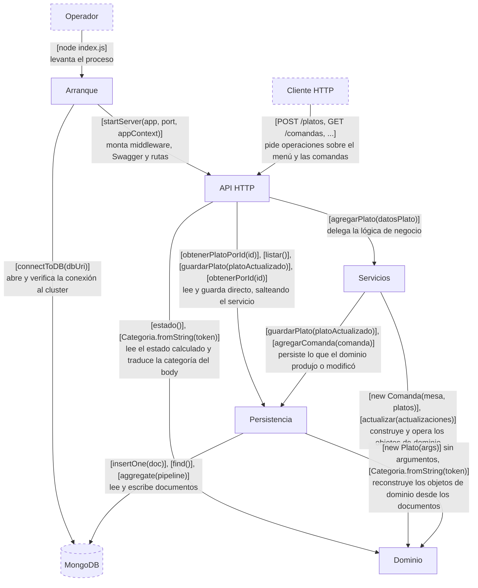

## Components

| Módulo | Responsabilidad | Estado | Interfacing points |
|---|---|---|---|
| **Arranque** ([index.js](../index.js), [src/app/db.js](../src/app/db.js), [src/app/context.js](../src/app/context.js)) | Poner el sistema en pie: abrir la conexión a MongoDB, instanciar cada componente con sus dependencias ya resueltas, y entregarle ese grafo al servidor. | El `MongoClient` conectado y el contexto de la aplicación — la única instancia de cada repositorio, servicio y controlador. | `connectToDB(dbUri)`, `buildAppContext(DB_CLIENT)` |
| **API HTTP** ([src/app/server.js](../src/app/server.js), [src/app/routes.js](../src/app/routes.js), [src/controllers/](../src/controllers/)) | Traducir entre HTTP y el resto del sistema: parsear la request, invocar la operación que corresponde, mapear objetos de dominio a JSON y excepciones de dominio a códigos de estado. | La aplicación Express con sus rutas montadas, y en cada controlador la referencia al servicio y al repositorio que usa. | Hacia el cliente, las once rutas HTTP de la tabla de [Ruteo](api-http.md#configureroutesapp-appcontext). Hacia adentro, `startServer(app, port, appContext)`, `new PlatosController(platosService, menu)`, `new ComandaController(comandaService, comandaRepository)`. |
| **Servicios** ([src/services/](../src/services/)) | Orquestar los casos de negocio que involucran más de un paso: resolver los platos del menú que una comanda referencia, construir los objetos de dominio, pedirle al dominio que se modifique y mandar a persistir el resultado. | Ninguno propio — sólo las referencias a los repositorios que necesita. | `new PlatosService(menu)`, `new ComandaService(comandaRepository, menu)`, `PlatosService.agregarPlato(datosPlato)`, `PlatosService.actualizarPlato(platoId, actualizaciones)`, `ComandaService.crearComanda(mesa, platos)`, `ComandaService.agregarPlatoComanda(idComanda, datosPlato)`, `ComandaService.actualizarBebidasComanda(idComanda, bebidasListas)`, `ComandaService.actualizarPlatoComanda(idComanda, actualizacionesPlato, ordenPlato)` |
| **Persistencia** ([src/repositories/](../src/repositories/)) | Ser el dueño de las colecciones de MongoDB y la única frontera donde un objeto de dominio se convierte en documento y viceversa. Nadie fuera de este módulo ve un `_id`, un `ObjectId` ni un pipeline de agregación. | Las colecciones `platos` y `comandas`. | `new Menu(db)`, `new ComandaRepository(db, menu)`, `Menu.agregarPlato(plato)`, `Menu.listar()`, `Menu.obtenerPlatoPorId(id)`, `Menu.guardarPlato(platoActualizado)`, `ComandaRepository.agregarComanda(comanda)`, `ComandaRepository.obtenerPorId(id)`, `ComandaRepository.listarPorFlags(platosPendientes, bebidasPendientes)` |
| **Dominio** ([src/domain/](../src/domain/), [src/excepciones/](../src/excepciones/)) | Modelar el negocio del restaurante y ser el dueño de sus reglas: qué es un plato válido, qué categorías existen y en qué orden se sirven, qué platos tiene una comanda, cuáles están listos, en qué estado está la comanda y cuánto suma la cuenta. | Cada instancia tiene el suyo: un `Plato` su nombre, categoría, precio y disponibilidad; una `Comanda` su mesa, sus `PlatoPedido`, si las bebidas están listas y si está pagada. | `new Plato(args)`, `Plato.actualizar(actualizaciones)`, `Plato.esDeCategoria(categoria)`, `Categoria.fromString(token)`, `new Comanda(mesa, platos)`, `Comanda.agregarPlato(plato)`, `Comanda.agregarNotas(ordenPlato, notas)`, `Comanda.asignarCantidad(ordenPlato, cantidad)`, `Comanda.marcarListo(ordenPlato, estaListo)`, `Comanda.marcarBebidasListas(bebidasListas)`, `Comanda.estado()`, `Comanda.bebidasPendientes()`, `Comanda.platosPendientes()`, `Comanda.totalAPagar()`, `new PlatoPedido(plato, cantidad, notas)` |

Cada módulo tiene su propio documento: [Arranque](arranque.md) ·
[API HTTP](api-http.md) · [Servicios](servicios.md) · [Persistencia](persistencia.md) ·
[Dominio](dominio.md).

## Use cases

### Arranque de la aplicación

Un operador levanta el proceso. El módulo Arranque conecta con MongoDB, arma el grafo de
objetos y se lo pasa al servidor, que queda escuchando.

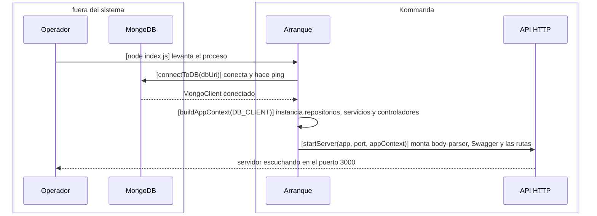

### Alta de un plato en el menú

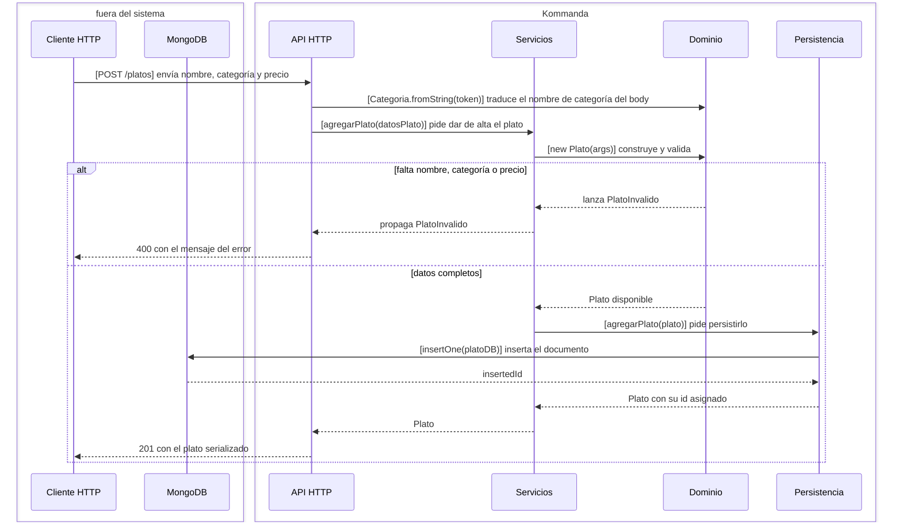

### Consulta del menú

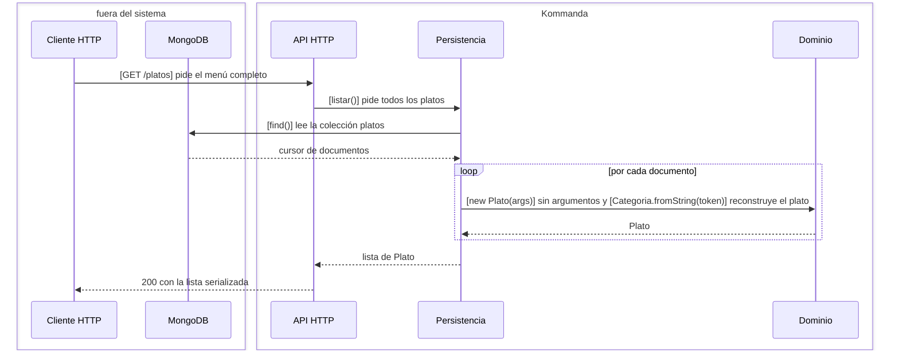

### Consulta de un plato

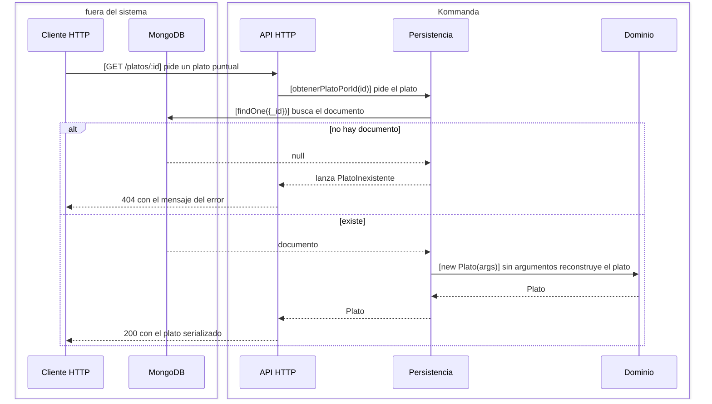

### Modificación de un plato

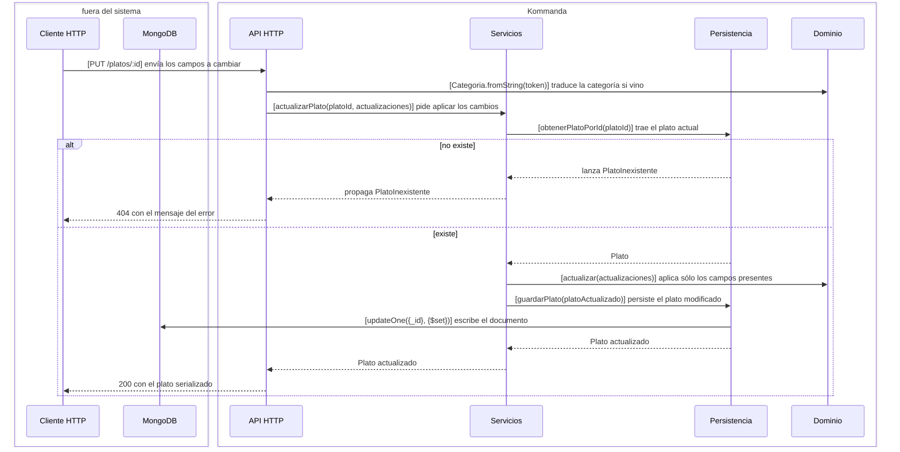

### Cambio de disponibilidad de un plato

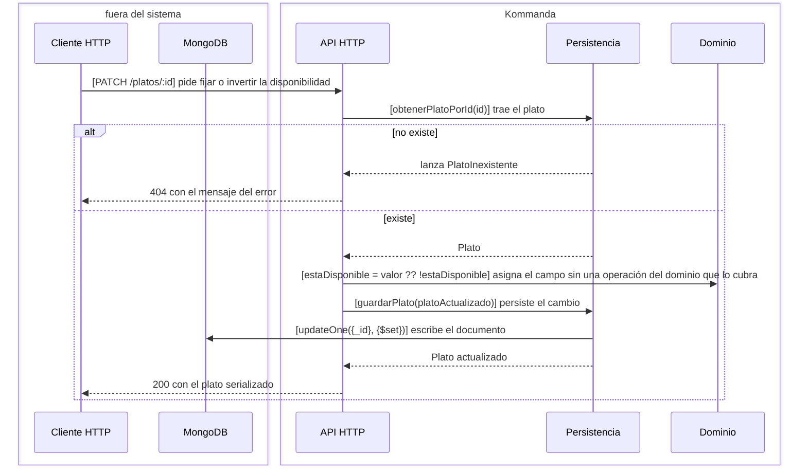

### Apertura de una comanda

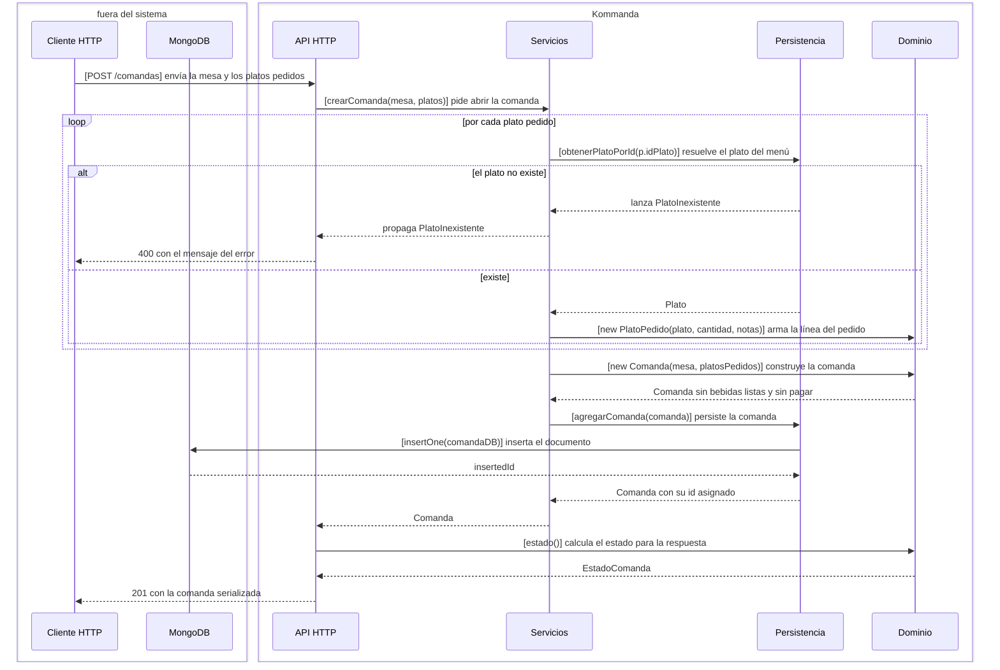

### Consulta de una comanda

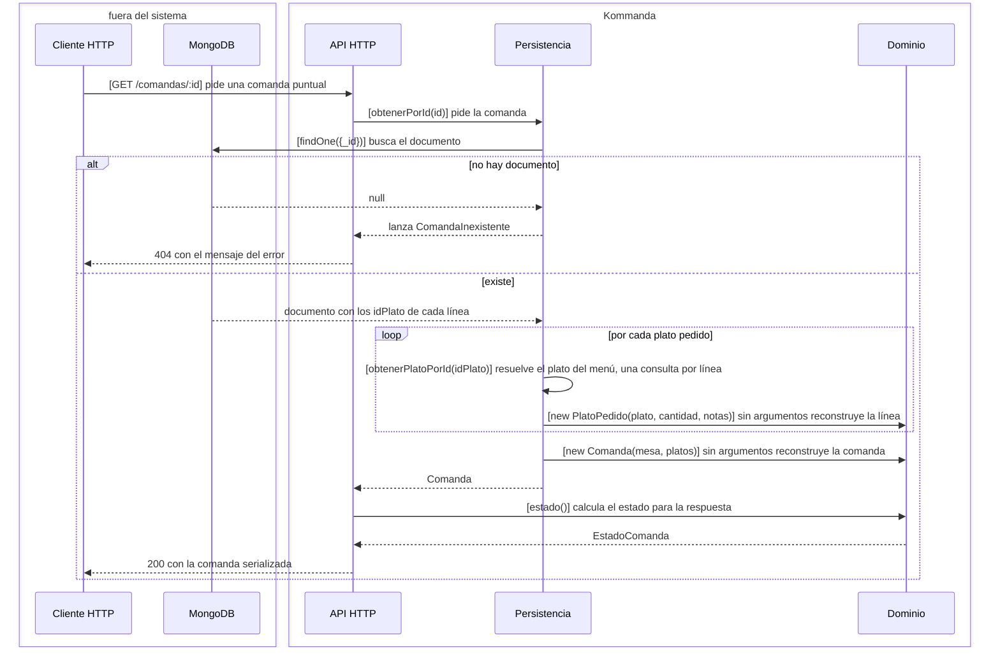

### Agregado de un plato a una comanda

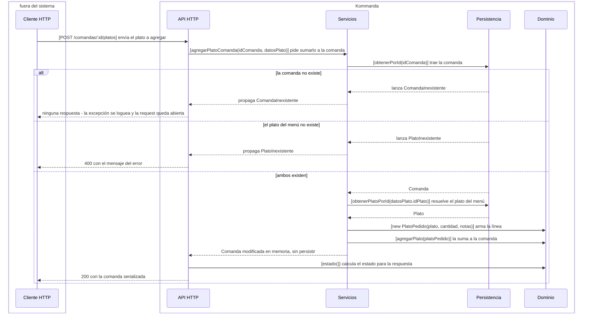

### Marcado de bebidas listas

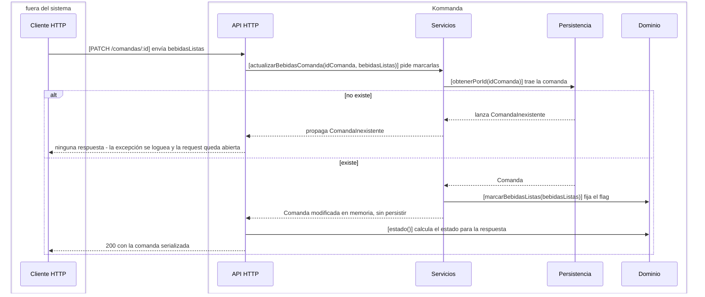

### Actualización de un plato pedido

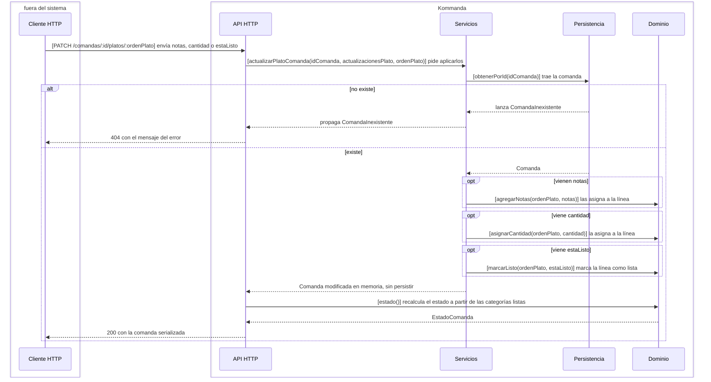

### Búsqueda de comandas pendientes

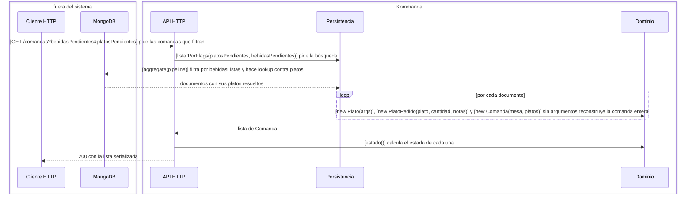

## Rejected alternatives

**Dividir el sistema por subdominio en vez de por capa.** Un corte en Menú y Comandas
daría tres módulos con estado propio en vez de uno sin estado, pero escondería dentro de
cada módulo la dirección de las dependencias, que es justamente la propiedad que este
documento existe para hacer verificable.

**Que los controladores hablen directo con MongoDB.** Concentrar el marshalling en
Persistencia es lo que permite que ni el dominio ni los servicios conozcan `ObjectId`,
`_id` ni la forma de los documentos. Cambiar de motor de base toca un solo módulo.

**Un dominio anémico, con los datos separados de las reglas.** `Comanda` calcula su propio
estado y `Plato` valida su propia construcción, así que ningún camino del sistema puede
producir un objeto inválido ni un estado inconsistente — ni siquiera uno que saltee los
servicios.
