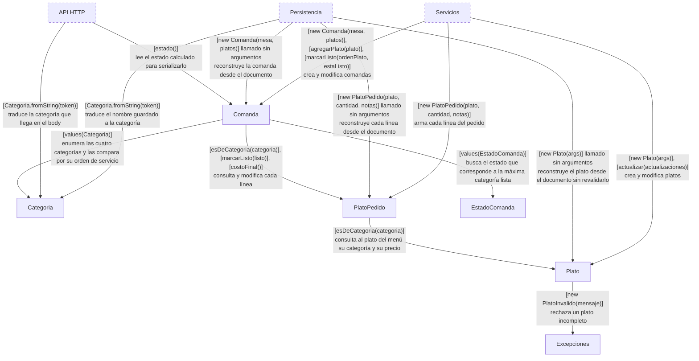
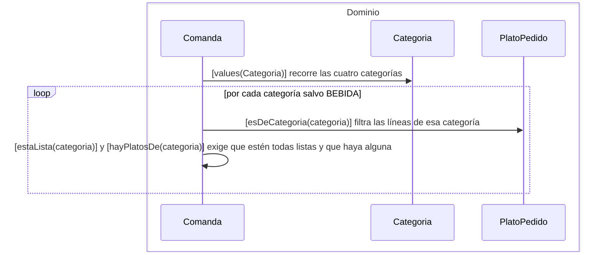
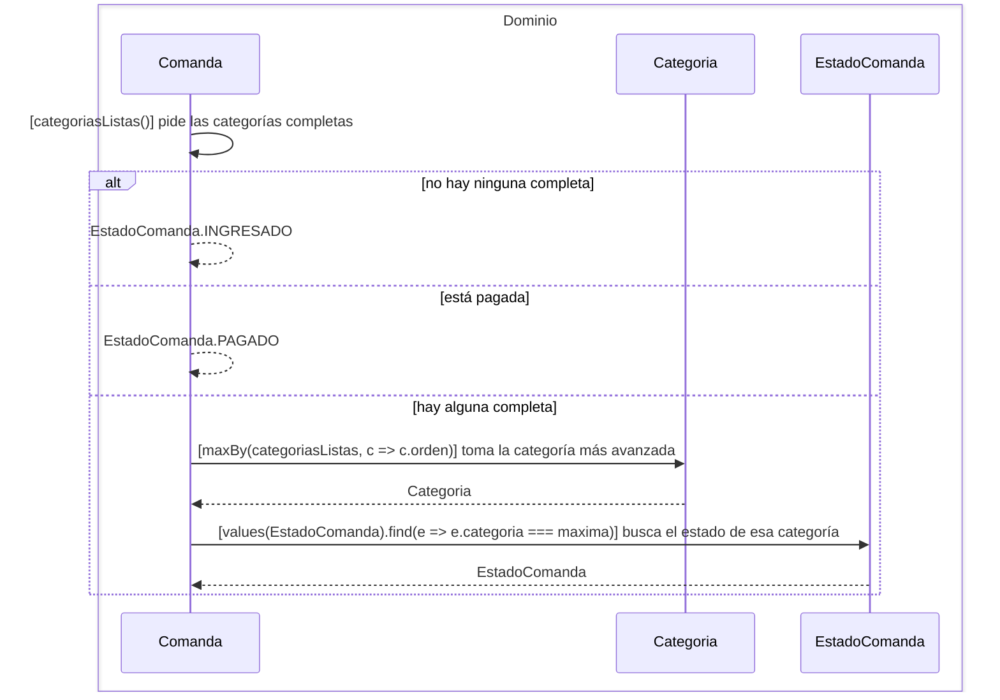
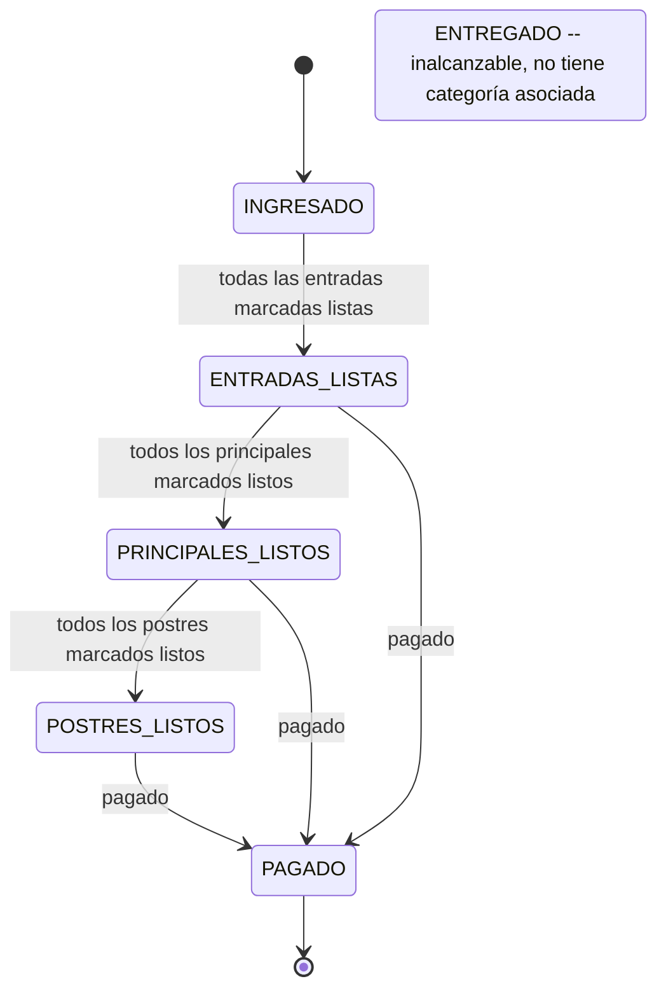

# Módulo Dominio

## Scope

El módulo Dominio modela el negocio del restaurante y es dueño de sus reglas: qué es un
plato válido, qué categorías existen y en qué orden se sirven, qué pidió una mesa, qué
está listo, en qué estado avanza una comanda y cuánto suma la cuenta.

Es el único módulo que no depende de ningún otro. No sabe que existe HTTP, ni MongoDB, ni
que alguien lo persiste: sus objetos se construyen, se les pide que se modifiquen y se
les pregunta. Las excepciones que lanza son parte de su interfaz — es lo que el resto del
sistema traduce a códigos de estado.

## Component diagram

## Plato

**Responsabilidad.** Modelar un ítem del menú y ser dueño de la regla de qué lo hace
válido: nombre, categoría y precio son obligatorios.

**Estado.** Su id, nombre, categoría, precio y si está disponible.

**Interfacing points.** `new Plato(args)`, `Plato.validarParametros({precio, nombre, categoria})`,
`actualizar(actualizaciones)`, `esDeCategoria(categoria)`.

### `new Plato(args)`

Valida que estén los tres campos obligatorios, los asigna y nace disponible. Un plato
inválido no llega a existir: el constructor lanza en vez de devolver un objeto a medias.

Llamado sin argumentos retorna antes de validar, dejando la instancia vacía. Ese es el
camino que usa Persistencia para reconstruir un plato ya guardado sin revalidarlo ni
pisarle la disponibilidad.

### `Plato.validarParametros({precio, nombre, categoria})`

Lanza `PlatoInvalido` si falta cualquiera de los tres, con un mensaje que dice qué llegó.
Es la única regla de validez del plato en todo el sistema.

#### Edge cases

La comprobación es por valor falsy, así que un precio de `0` cuenta como faltante. Un
plato gratis no se puede dar de alta.

### `actualizar(actualizaciones)`

Asigna sólo los campos presentes en la actualización, dejando el resto como estaba. Es
por eso que un `PUT` parcial no borra los campos que no vinieron.

#### Edge cases

La guarda es por valor falsy, igual que en la validación: `precio: 0` o `nombre: ""` no se
aplican. Y como no vuelve a llamar a `validarParametros`, la actualización no puede dejar
al plato inválido, pero tampoco lo revalida.

### `esDeCategoria(categoria)`

Compara la categoría del plato por identidad contra la recibida. Funciona porque las
categorías son las cuatro instancias fijas de `Categoria`, no strings.

## Categoria

**Responsabilidad.** Enumerar las cuatro categorías del menú y ser dueña del orden en que
se sirven, que es lo que le permite a la comanda saber cuál es la categoría más avanzada
que ya está lista.

**Estado.** Su nombre y su orden. Las cuatro instancias —`ENTRADA`, `PRINCIPAL`, `POSTRE`,
`BEBIDA`— se crean una sola vez como propiedades estáticas de la clase.

**Interfacing points.** `Categoria.fromString(token)`, y las cuatro instancias.

### `Categoria.fromString(token)`

Busca entre las instancias estáticas la que tenga ese nombre. Es la puerta de entrada
desde cualquier representación en texto — el body de una request, un documento de la base
— al objeto del dominio.

#### Edge cases

Un token desconocido devuelve `undefined`, no una excepción. Quien lo recibe decide qué
hacer: el constructor de `Plato` lo trata como categoría faltante.

### Rejected alternatives

**`Categoria` como un string.** Ser un objeto con `orden` es lo que hace que
`Comanda.estado()` sea un `maxBy`. Con strings, el orden de servicio tendría que vivir en
una tabla suelta, fuera de la clase que define las categorías.

## PlatoPedido

**Responsabilidad.** Modelar una línea del pedido: qué plato del menú, cuántos, con qué
notas y si ya salió de la cocina.

**Estado.** El `Plato` referenciado, la cantidad, las notas y si está listo.

**Interfacing points.** `new PlatoPedido(plato, cantidad, notas)`, `esDeCategoria(categoria)`,
`agregarNotas(notas)`, `asignarCantidad(cantidad)`, `marcarListo(listo)`, `costoFinal()`.

### `new PlatoPedido(plato, cantidad, notas)`

Guarda la referencia al plato del menú y nace no listo. No valida nada — a diferencia de
`Plato`, una línea sin cantidad se construye igual.

### `esDeCategoria(categoria)`

Delega en el plato referenciado. Es lo que le permite a la comanda agrupar sus líneas por
categoría sin conocer la estructura de un `Plato`.

### `agregarNotas(notas)`

Pisa las notas de la línea con las recibidas. El nombre dice agregar, la operación
reemplaza.

### `asignarCantidad(cantidad)`

Fija la cantidad de la línea.

### `marcarListo(listo)`

Fija si la línea salió de la cocina. Es la marca que hace avanzar el estado de la comanda
entera.

### `costoFinal()`

Multiplica la cantidad por el precio del plato del menú. Toma el precio en el momento en
que se pregunta, no el que tenía cuando se pidió — consecuencia directa de que la comanda
guarde el plato por referencia.

## Comanda

**Responsabilidad.** Modelar el pedido de una mesa y ser dueña de todo lo que se deduce de
él: qué líneas la componen, qué categorías están completas, en qué estado está la comanda
y cuánto hay que pagar.

**Estado.** Su id, la mesa, sus `PlatoPedido`, si las bebidas están listas y si está
pagada.

**Interfacing points.** `new Comanda(mesa, platos)`, `agregarPlato(plato)`,
`removerPlato(plato)`, `agregarNotas(ordenPlato, notas)`,
`asignarCantidad(ordenPlato, cantidad)`, `marcarListo(ordenPlato, estaListo)`,
`marcarBebidasListas(bebidasListas)`, `bebidasPendientes()`, `platosPendientes()`,
`categoriasListas()`, `hayPlatosDe(categoria)`, `estaLista(categoria)`, `estado()`,
`totalAPagar()`.

### `new Comanda(mesa, platos)`

Fija la mesa y las líneas, y nace con las bebidas pendientes y sin pagar. Llamado sin
mesa retorna antes de asignar nada — ese es el camino que usa Persistencia para
reconstruir una comanda guardada.

#### Edge cases

`validarParametros(mesa)` está escrito para lanzar `ComandaInvalida`, pero el constructor
retorna antes de llamarlo cuando la mesa falta, así que nunca se ejecuta con una mesa
vacía. Si llegara a ejecutarse, `ComandaInvalida` no está importada en el archivo y el
resultado sería un `ReferenceError`, no la excepción del dominio. Ningún camino del
sistema produce una `ComandaInvalida`, aunque tres handlers la traducen a 400.

### `agregarPlato(plato)`

Suma una línea al final. El índice que queda es el `ordenPlato` con el que después se la
referencia desde la API.

### `removerPlato(plato)`

Saca la línea de la comanda. No tiene llamadores: ninguna ruta expone quitar un plato de
una comanda.

### `agregarNotas(ordenPlato, notas)`

Delega en la línea que está en esa posición.

### `asignarCantidad(ordenPlato, cantidad)`

Delega en la línea que está en esa posición.

### `marcarListo(ordenPlato, estaListo)`

Delega en la línea que está en esa posición. Es la operación que hace avanzar el estado
de la comanda, porque `estado()` se recalcula a partir de qué líneas están listas.

#### Edge cases

Las tres operaciones por índice acceden a `this.platos[ordenPlato]` sin comprobar rango:
un índice inexistente da un `TypeError`.

### `marcarBebidasListas(bebidasListas)`

Fija el flag de bebidas. Las bebidas se marcan de una para toda la comanda, no línea por
línea como el resto de las categorías — por eso `categoriasListas()` excluye `BEBIDA`.

### `bebidasPendientes()`

Devuelve si las bebidas todavía no salieron.

### `platosPendientes()`

Devuelve si queda alguna línea sin marcar como lista.

### `hayPlatosDe(categoria)`

Devuelve si la comanda tiene al menos una línea de esa categoría.

### `estaLista(categoria)`

Devuelve si todas las líneas de esa categoría están marcadas listas. Sobre una comanda
sin líneas de esa categoría devuelve verdadero, porque un `every` sobre una lista vacía lo
es — de ahí que `categoriasListas()` la combine siempre con `hayPlatosDe`.

### `categoriasListas()`

Devuelve las categorías que la comanda efectivamente tiene y que están completas,
excluyendo las bebidas.

### `estado()`

Calcula el estado de la comanda: si no hay ninguna categoría completa está `INGRESADO`,
si está pagada está `PAGADO`, y si no, el estado que corresponde a la categoría más
avanzada que ya salió.

#### Edge cases

El orden de las ramas hace que una comanda pagada sin ninguna categoría completa se
informe como `INGRESADO`.

`ENTREGADO` no lo produce ningún camino: no está asociado a ninguna categoría, así que el
`find` nunca lo devuelve.

### `totalAPagar()`

Suma el costo final de cada línea. No tiene llamadores: ninguna ruta expone la cuenta.

### Specifics

El estado de una comanda no se guarda: se deduce cada vez de qué líneas están listas. Es
lo que hace que marcar un plato como listo alcance para que la comanda avance, sin que
nadie tenga que mantener una máquina de estados en paralelo con las líneas, y hace
imposible que el estado quede desincronizado. El costo es que `estado()` recorre las
líneas en cada lectura.

**Rechazado: guardar el estado como un campo de la comanda.** Sería una lectura constante
en vez de un recorrido, a cambio de dos representaciones de lo mismo que pueden divergir.

## EstadoComanda

**Responsabilidad.** Enumerar los estados por los que pasa una comanda y decir, para cada
uno, qué categoría completa lo produce.

**Estado.** Su nombre y la categoría asociada, cuando tiene. Las seis instancias se crean
una sola vez como propiedades estáticas.

**Interfacing points.** Las seis instancias: `INGRESADO`, `ENTRADAS_LISTAS`,
`PRINCIPALES_LISTOS`, `POSTRES_LISTOS`, `ENTREGADO`, `PAGADO`.

### Edge cases

Una comanda que no tiene entradas pero sí principales salta directo a
`PRINCIPALES_LISTOS`: el estado sale de la categoría de mayor orden entre las completas,
no de recorrer la secuencia paso a paso.

`PAGADO` tampoco es alcanzable: `Comanda.pagado` no se asigna en ninguna operación del
sistema.

### Rejected alternatives

**`EstadoComanda` como un string.** Que cada estado lleve su `categoria` es lo que permite
que `Comanda.estado()` sea un `find` sobre las instancias. Con strings, el mapeo
categoría-a-estado tendría que vivir fuera de la clase que define los estados.

## Excepciones

**Responsabilidad.** Nombrar las cuatro formas en que una operación del dominio puede
fallar, para que el API HTTP pueda traducirlas a códigos de estado sin inspeccionar
mensajes.

**Estado.** El mensaje, ya prefijado con el tipo de error.

**Interfacing points.** `new PlatoInvalido(mensaje)`, `new PlatoInexistente(id)`,
`new ComandaInvalida(mensaje)`, `new ComandaInexistente(id)`.

### Edge cases

`PlatoInexistente` y `ComandaInexistente` las lanza Persistencia, no el Dominio, aunque
vivan acá. Son parte del vocabulario de errores del negocio y no del de la base — por eso
el módulo de persistencia puede traducir un `null` de Mongo a algo que el resto del
sistema entiende.
