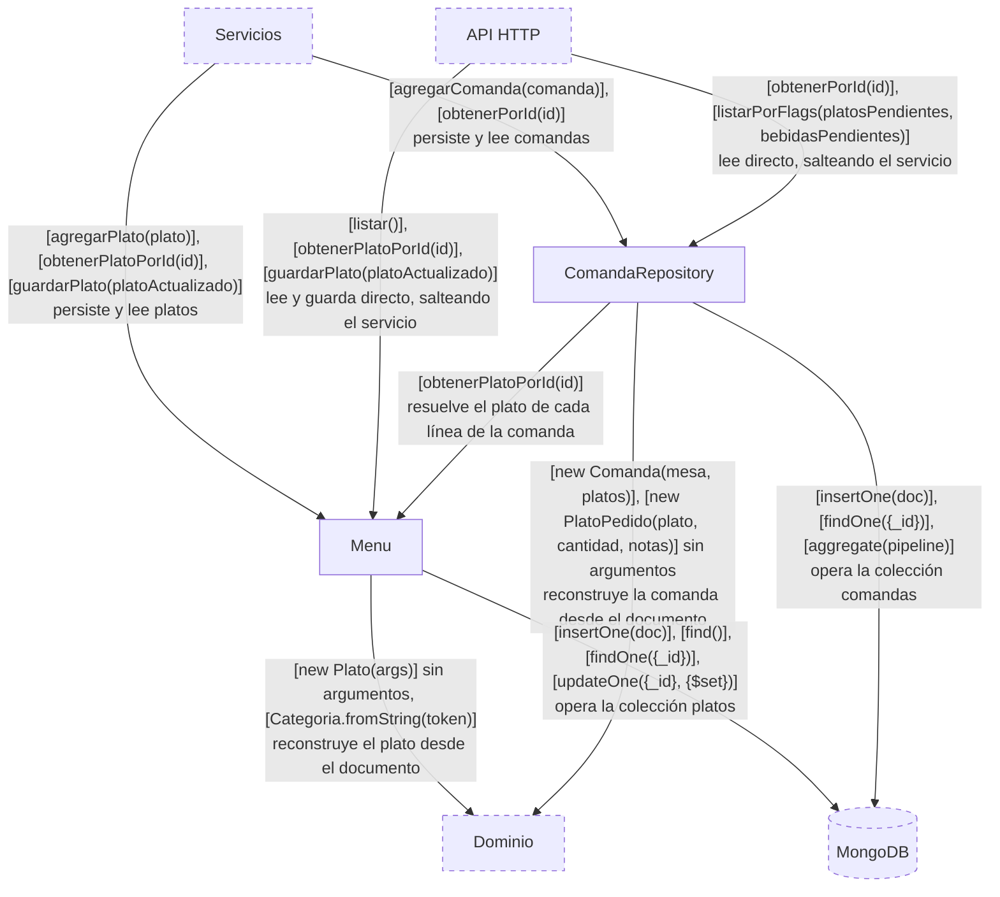
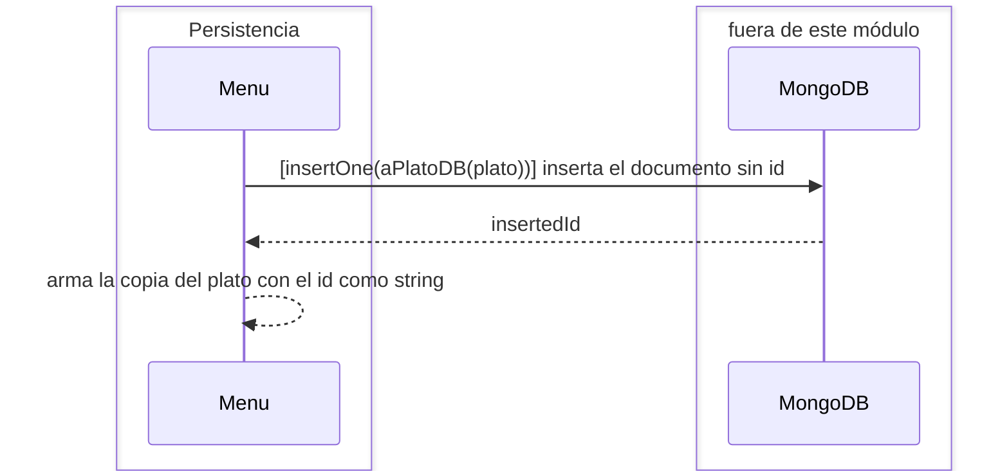
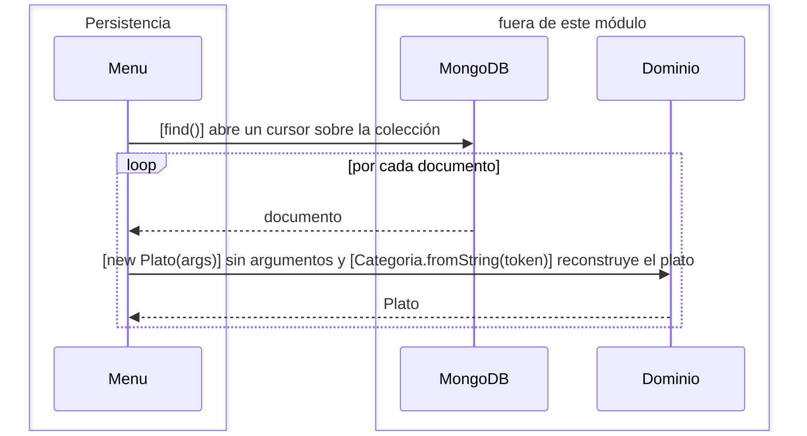
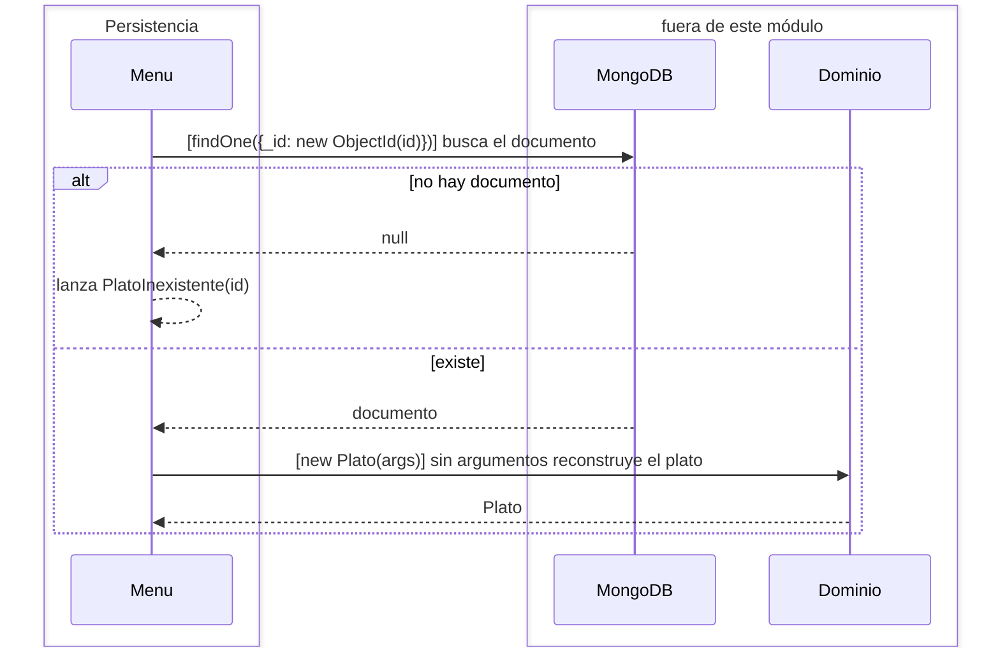
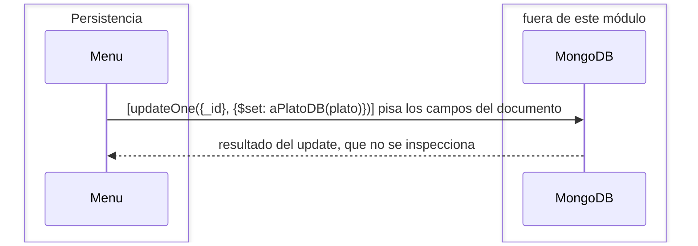
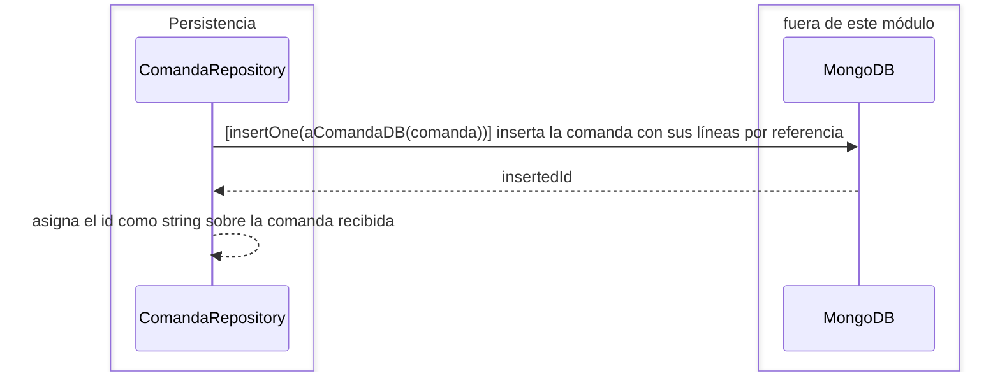
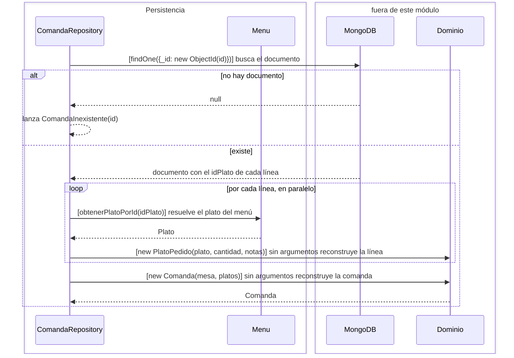
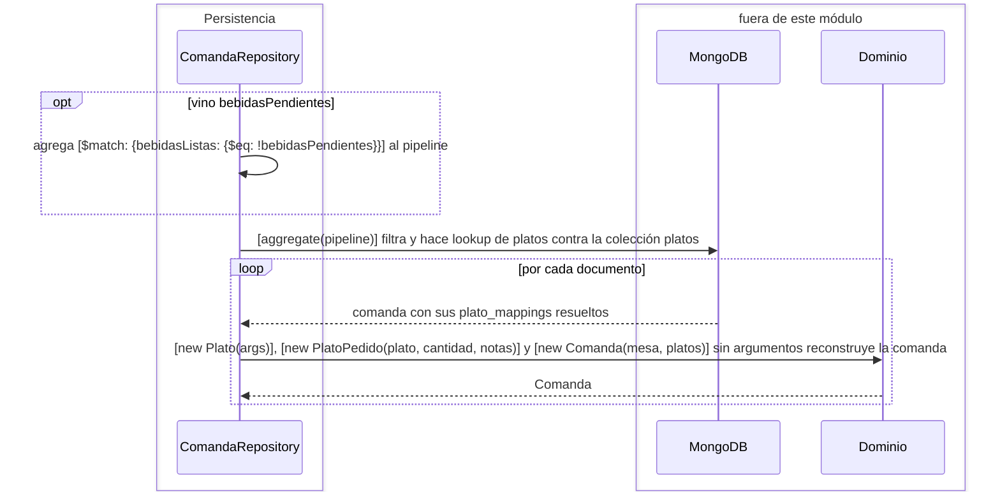

# Módulo Persistencia

## Scope

El módulo Persistencia es dueño de las dos colecciones de MongoDB y es la única frontera
donde un objeto de dominio se convierte en documento y un documento vuelve a ser objeto
de dominio. Fuera de este módulo nadie ve un `_id`, un `ObjectId` ni un pipeline de
agregación: los ids circulan como strings y los platos y comandas como objetos de
dominio.

El módulo no contiene reglas de negocio. Decide cómo se guarda una comanda — por
referencia al plato, no por copia — y cómo se la vuelve a armar, pero no decide qué es
una comanda válida ni en qué estado está.

## Component diagram

## Menu

**Responsabilidad.** Ser el catálogo de platos: la única fuente de verdad sobre qué
platos existen, y el único componente que traduce entre un `Plato` del dominio y un
documento de la colección `platos`.

**Estado.** La colección `platos`.

**Interfacing points.** `new Menu(db)`, `agregarPlato(plato)`, `listar()`,
`obtenerPlatoPorId(id)`, `guardarPlato(platoActualizado)`.

### `new Menu(db)`

Toma la colección `platos` de la base recibida. Es lo único que necesita: el catálogo no
depende de ningún otro componente.

### `agregarPlato(plato)`

Inserta el plato como documento nuevo y devuelve una copia con el id que asignó Mongo,
como string.

### `listar()`

Recorre la colección entera y devuelve un `Plato` por documento. No pagina ni filtra: el
menú se asume chico.

### `obtenerPlatoPorId(id)`

Busca el documento por `_id` y lo reconstruye. Si no está, lanza `PlatoInexistente` — es
esa excepción, y no un `null`, lo que el resto del sistema traduce a un 404.

#### Edge cases

Un id que no tenga la forma de un `ObjectId` hace que el constructor de `ObjectId` lance
un `BSONError`, no `PlatoInexistente`: llega al cliente como una request sin respuesta, no
como un 404.

### `guardarPlato(platoActualizado)`

Pisa el documento con los campos del plato recibido y lo devuelve tal cual llegó. No
comprueba que exista: un id que no está en la colección produce un update que no toca
nada y una respuesta exitosa.

### Specifics

La traducción la hacen dos operaciones internas: `aPlatoDB`, que baja la `Categoria` a su
nombre y borra el `id` para que Mongo maneje la clave, y `dePlatoDB`, que arma un `Plato`
vacío y le asigna los campos con `Object.assign` — pasando por `Categoria.fromString` — sin
volver a pasar por el constructor, para que un documento ya guardado no se revalide.

## ComandaRepository

**Responsabilidad.** Ser dueño de la colección `comandas` y de la decisión de cómo se
guarda una comanda: cada línea del pedido conserva sólo el `idPlato`, no una copia del
plato, para que el menú siga siendo la única fuente de verdad sobre nombre y precio.
Reconstruirla implica volver a resolver esos platos.

**Estado.** La colección `comandas`, y la referencia al `Menu` que necesita para resolver
los platos.

**Interfacing points.** `new ComandaRepository(db, menu)`, `agregarComanda(comanda)`,
`obtenerPorId(id)`, `listarPorFlags(platosPendientes, bebidasPendientes)`.

### `new ComandaRepository(db, menu)`

Toma la colección `comandas` de la base y guarda la referencia al `Menu`, que necesita
para resolver el plato de cada línea al reconstruir una comanda.

### `agregarComanda(comanda)`

Baja la comanda a documento — cada `PlatoPedido` pierde su `Plato` y conserva el
`idPlato` como `ObjectId` — la inserta, y le asigna a la comanda recibida el id que
devolvió Mongo.

### `obtenerPorId(id)`

Busca la comanda por `_id` y la reconstruye resolviendo cada línea contra el `Menu`. Si
no está, lanza `ComandaInexistente`.

#### Edge cases

Cada línea de la comanda cuesta una consulta al `Menu`: una comanda de ocho platos son
nueve viajes a la base. `listarPorFlags` resuelve el mismo problema con un `$lookup`: el
componente reconstruye una comanda de dos maneras distintas según por dónde se la pida.

Si un plato del menú se borró después de haberse pedido, `obtenerPlatoPorId` lanza
`PlatoInexistente` y la comanda entera deja de poder leerse.

### `listarPorFlags(platosPendientes, bebidasPendientes)`

Arma un pipeline de agregación que filtra por el flag de bebidas cuando vino, y en un
`$lookup` trae de una todos los platos referenciados. Reconstruye cada comanda cruzando
las líneas contra ese resultado.

#### Edge cases

`platosPendientes` se recibe y no se usa: el pipeline sólo filtra por bebidas. El
predicado existe en el dominio, en `Comanda.platosPendientes()`, pero nadie lo aplica.

La reconstrucción está escrita a mano dentro del bucle en vez de reusar `deComandaDB` y
`dePlatoDB`, porque los platos vienen del `$lookup` y no del `Menu`. Es la misma
traducción escrita dos veces en el mismo componente.

### Rejected alternatives

**Embeber el plato completo en cada línea de la comanda.** Haría la lectura de una
comanda un solo `findOne` sin resolución alguna, pero congelaría el nombre y el precio al
momento del pedido y le sacaría al `Menu` la propiedad de ser la única fuente de verdad
sobre un plato. La comanda guarda sólo el `idPlato`.

## Rejected alternatives

**Un único repositorio para las dos colecciones.** El menú es un catálogo estable que se
consulta desde todas partes, las comandas son efímeras y lo referencian. Un repositorio
único acoplaría los dos ciclos de vida y le daría al catálogo la responsabilidad de
resolver referencias de comandas.

**Reconstruir el dominio pasando por sus constructores.** `dePlatoDB` y `deComandaDB`
arman la instancia vacía y le asignan los campos con `Object.assign`. Pasar por el
constructor volvería a validar y a fijar los valores iniciales — `estaDisponible = true`,
`pagado = false` — pisando lo que la base tiene guardado. Es por eso que los constructores
de `Plato` y `Comanda` retornan temprano cuando los llaman sin argumentos.
