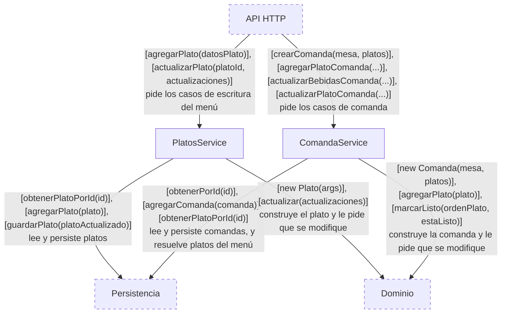
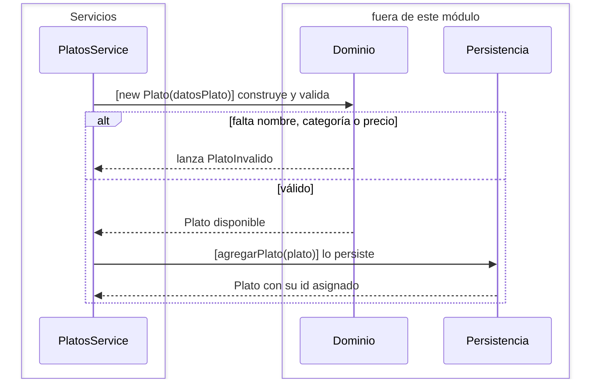
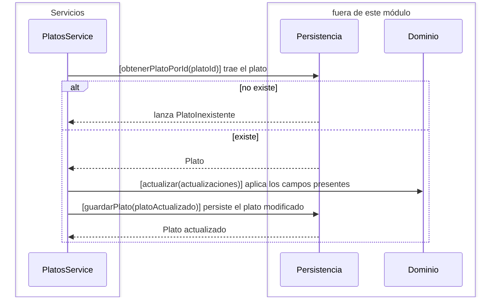
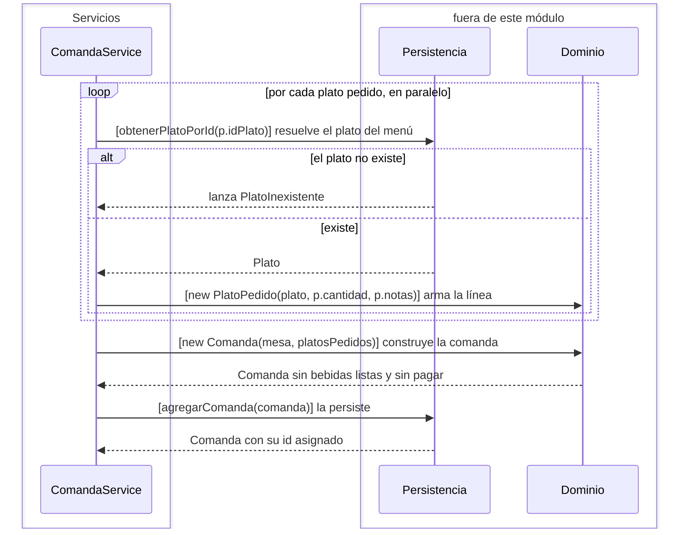
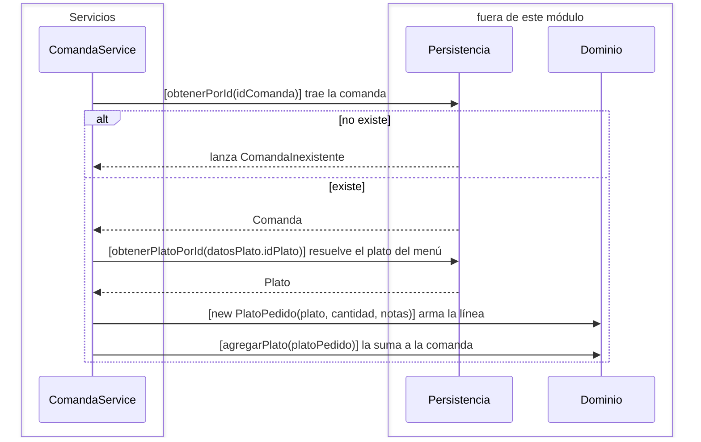
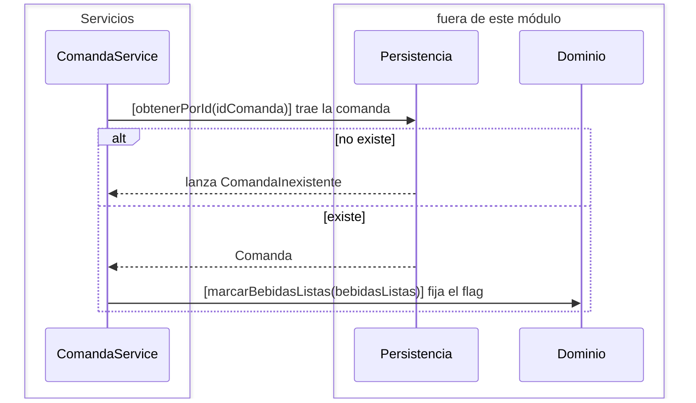
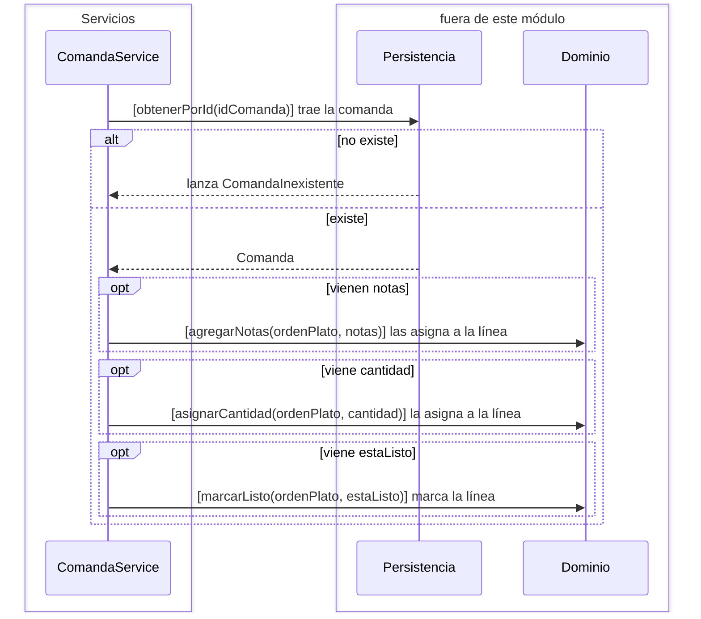

# Módulo Servicios

## Scope

El módulo Servicios orquesta los casos de negocio que no se resuelven en un solo paso:
resolver contra el menú los platos que una comanda referencia, construir los objetos de
dominio, pedirle al dominio que aplique el cambio y mandar a persistir el resultado.

Es el módulo que sabe en qué orden pasan las cosas. No sabe nada de HTTP ni de MongoDB, y
no contiene reglas del negocio: validar un plato, calcular el estado de una comanda o
sumar la cuenta son cosas que le pide al Dominio.

## Component diagram

## PlatosService

**Responsabilidad.** Orquestar los dos casos del menú que escriben: dar de alta un plato
y modificar uno existente.

**Estado.** Ninguno propio — sólo la referencia al `Menu`. Un servicio sin estado es un
componente delgado por diseño: existe para que el orden de los pasos tenga un dueño, no
para recordar nada entre llamadas.

**Interfacing points.** `new PlatosService(menu)`, `agregarPlato(datosPlato)`,
`actualizarPlato(platoId, actualizaciones)`.

### `new PlatosService(menu)`

Guarda la referencia al `Menu`, que es su única dependencia.

### `agregarPlato(datosPlato)`

Construye un `Plato` con los datos recibidos — y es el constructor el que valida, así que
un plato incompleto nunca llega a la base — y le pide al `Menu` que lo persista.

### `actualizarPlato(platoId, actualizaciones)`

Trae el plato del menú, le pide que aplique los cambios y lo manda a guardar. Es el
dominio el que decide qué se actualiza: sólo los campos presentes en `actualizaciones`.

## ComandaService

**Responsabilidad.** Orquestar los casos de comanda: abrir una comanda resolviendo cada
plato pedido contra el menú, sumarle platos, y aplicarle las marcas que llegan desde la
cocina y el salón.

**Estado.** Ninguno propio — las referencias al `ComandaRepository` y al `Menu`.

**Interfacing points.** `new ComandaService(comandaRepository, menu)`,
`crearComanda(mesa, platos)`, `agregarPlatoComanda(idComanda, datosPlato)`,
`actualizarBebidasComanda(idComanda, bebidasListas)`,
`actualizarPlatoComanda(idComanda, actualizacionesPlato, ordenPlato)`.

### `new ComandaService(comandaRepository, menu)`

Guarda las dos referencias que sus operaciones usan: el repositorio de comandas y el
`Menu`, porque cada línea de un pedido hay que resolverla contra el catálogo.

### `crearComanda(mesa, platos)`

Resuelve cada línea del pedido contra el menú — un `idPlato` que no existe corta la
operación entera —, arma un `PlatoPedido` por línea, construye la `Comanda` y la
persiste. Las resoluciones contra el menú van en paralelo con `Promise.all`.

### `agregarPlatoComanda(idComanda, datosPlato)`

Trae la comanda, resuelve el plato contra el menú, arma la línea y se la agrega. Devuelve
la comanda con el plato ya sumado.

#### Edge cases

La comanda modificada no se persiste: no hay una operación de guardado en
`ComandaRepository` y esta operación no la llama. El cliente ve el plato agregado en la
respuesta, y la próxima lectura de la comanda no lo tiene.

### `actualizarBebidasComanda(idComanda, bebidasListas)`

Trae la comanda y le pide que fije el flag de bebidas. Devuelve la comanda ya marcada.

#### Edge cases

Como en `agregarPlatoComanda`, el cambio queda sólo en memoria.

### `actualizarPlatoComanda(idComanda, actualizacionesPlato, ordenPlato)`

Trae la comanda y le pide, por cada campo presente en la actualización, que lo aplique
sobre la línea `ordenPlato`. Marcar una línea como lista es lo que hace avanzar el estado
de la comanda, porque `estado()` se calcula a partir de qué categorías están completas.

#### Edge cases

La guarda de cada campo es `if (actualizacionesPlato.campo)`, no una comprobación de
presencia: `estaListo: false` y `cantidad: 0` no se aplican. Una línea marcada lista no se
puede desmarcar por esta vía.

El cambio queda sólo en memoria, igual que en las dos operaciones anteriores.

## Rejected alternatives

**Un solo servicio para todo el backend.** Los dos servicios tienen dependencias
distintas — uno sólo necesita el menú, el otro necesita las comandas y el menú — y sus
casos no se cruzan. Unirlos daría una clase con cuatro dependencias y ninguna cohesión.

**Que el servicio valide los datos antes de construir el dominio.** La validación vive en
el constructor de `Plato` y en el de `Comanda`, así que ningún camino puede producir un
objeto inválido — ni siquiera uno que saltee el servicio. Repetir la validación acá daría
dos lugares donde la regla puede divergir.
