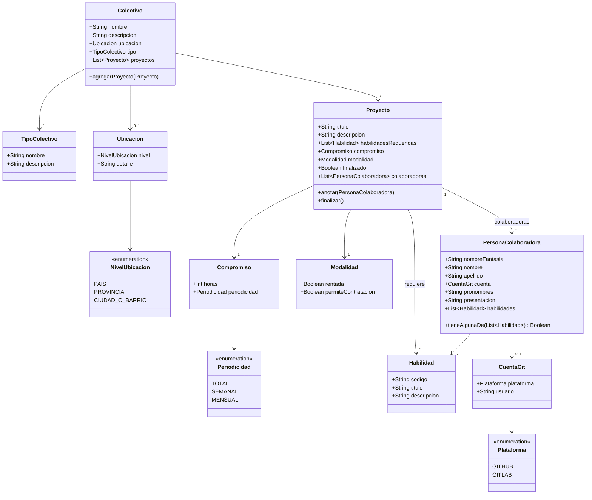

# Código a Voluntad — Diagrama de clases del dominio

## Notas de diseño

- `Proyecto.anotar()` valida que el proyecto no esté finalizado y que la persona tenga al menos una de las habilidades requeridas; recién ahí la suma a `colaboradoras`.
- `Proyecto.finalizar()` marca `finalizado = true`; a partir de ese momento `anotar()` falla.
- `TipoColectivo` es un objeto y no un enum porque el enunciado anticipa que la clasificación se amplíe.
- El anonimato de una `PersonaColaboradora` se deriva de si cargó `nombre`/`apellido`, sin necesidad de una jerarquía de clases. Hay otras formas válidas de modelarlo.
- `Modalidad` se resuelve con dos booleanos (`rentada`, `permiteContratacion`). Es una decisión de modelado entre varias posibles igualmente válidas.
- No modelamos una clase `Colaboracion`: hoy no tendría más que la persona anotada, así que sería un pasamanos sin comportamiento propio. La relación entre `Proyecto` y `PersonaColaboradora` alcanza. Cuando la colaboración tenga datos o reglas propias — fecha de anotación, estado, horas dedicadas — va a tener sentido darle su propia clase.
